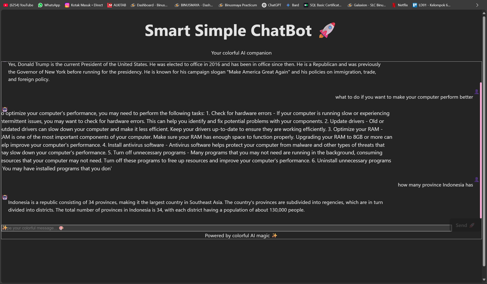

# 💬 Smart Simple ChatBot 🤖

A colorful AI chatbot powered by a local **LLaMA-based model (.gguf)**, built with **FastAPI** on the backend and **React + Vite + TailwindCSS** on the frontend. Enjoy blazing fast interaction with your own private AI chatbot, fully offline and customizable!

<p align="center">
  
</p>


---

## 📌 Features

- ✅ FastAPI backend with CORS enabled
- ✅ Local LLaMA-compatible `.gguf` model via `llama.cpp`
- ✅ Beautiful animated UI using React + Vite + TailwindCSS
- ✅ Role-based chat (User 🤝 Bot 🤖)
- ✅ Typing animation with bot response delay
- ✅ Fully local & offline (no OpenAI key needed)

---

## 🧠 AI Model Information

- **Model**: [TinyLlama-1.1B-Chat-v1.0](https://huggingface.co/TinyLlama/TinyLlama-1.1B-Chat-v1.0)
- **File Format**: `.gguf` (Quantized)
- **File Name**: `TinyLlama-1.1B-Chat-v1.0.Q4_K_M.gguf`
- **Source**: Downloaded from [HuggingFace](https://huggingface.co)
- **Inference Engine**: `llama-cpp-python`

---

## ⚙️ Tech Stack

### 🧠 Backend (FastAPI + LLaMA.cpp)

| Feature           | Tech                        |
|------------------|-----------------------------|
| API Framework    | FastAPI                     |
| Model Loader     | llama-cpp-python (`Llama`)  |
| Schema           | pydantic                    |
| Language         | Python 3.10+                |
| AI Model         | `.gguf` local model         |

### 🎨 Frontend (React + Vite)

| Feature           | Tech                  |
|------------------|-----------------------|
| Framework        | React (Vite)          |
| Styling          | TailwindCSS           |
| Animations       | CSS keyframes         |
| Package Manager  | npm / yarn            |
| State Management | React useState        |

---

## 🚀 How to Run Locally

### 1. 🔧 Backend Setup

```bash
# Clone repo & go to backend directory
cd backend/

# Install Python dependencies
pip install fastapi uvicorn pydantic llama-cpp-python

# Make sure the model exists
mkdir -p models/
# Place your .gguf file in ./models/
# Example: models/TinyLlama-1.1B-Chat-v1.0.Q4_K_M.gguf

# Run the server
uvicorn main:app --reload --port 8000
